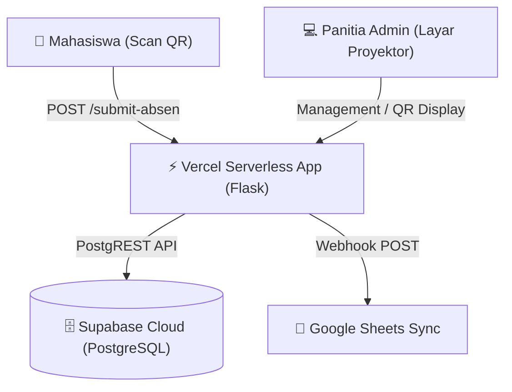

# 🚀 BAPENAS OKK ETHIVATION 2026 - Dynamic QR Attendance System


Sistem Informasi Presensi & Manajemen Sesi **OKK ETHIVATION 2026 (BAPENAS / UNDIKA)** berbasis **QR Code Dinamis**, **Vercel Serverless**, dan **Supabase Cloud Database (PostgreSQL)**.

🌐 **Production URL**: [https://okk2026.site](https://okk2026.site)  
🌐 **Alternative URL**: [https://bapenas-okk.vercel.app](https://bapenas-okk.vercel.app)

---

## ✨ Fitur Utama

- ⚡ **Full Live 24/7 Serverless Hosting**: Berjalan di atas Vercel Serverless Functions tanpa perlu menyalakan server/laptop lokal.
- 🗄️ **Database Cloud Real-Time**: Terintegrasi penuh dengan **Supabase PostgreSQL** untuk penyimpanan data presensi yang aman, cepat, dan terpusat.
- 📱 **QR Code Presensi Dinamis**: Panitia dapat menampilkan QR Code di proyektor yang berganti secara otomatis.
- 🚫 **Anti-Duplikat Presensi**: 1 NIM hanya dapat melakukan presensi 1 kali pada sesi yang sama.
- 📊 **Ekspor Excel Multi-Tab Otomatis**: Rekapan presensi (`.xlsx`) secara otomatis dipisahkan ke dalam puluhan Sheet/Tab sesuai nama **Agora** masing-masing.
- 📄 **Google Sheets Real-Time Sync**: Sinkronisasi otomatis data presensi mahasiswa ke Google Sheets via Google Apps Script Webhook.
- 🔐 **Portal Admin Panitia Aman**: Dilengkapi otentikasi PIN Rahasia Panitia yang dapat dikonfigurasi secara dinamis via Environment Variables (`ADMIN_PIN`).
- 🎨 **Tampilan Responsive & Mobile-Friendly**: Form scan presensi mahasiswa nyaman digunakan di Smartphone (iOS & Android).

---

## 🏗️ Arsitektur Sistem



---

## 🛠️ Teknologi yang Digunakan

* **Backend Framework**: Python 3 (Flask, Waitress, OpenPyXL, Requests)
* **Cloud Database**: Supabase PostgreSQL
* **Serverless Platform**: Vercel Serverless Functions (`@vercel/python`)
* **Frontend**: HTML5, CSS3 (Modern Glassmorphism Design), Vanilla JavaScript

---

## 📋 Struktur Folder

```text
BAPENAS-OKK/
├── api/
│   └── index.py            # Entrypoint Vercel Serverless Handler
├── QR-ABSEN/
│   ├── templates/          # HTML Web Templates (Login, Panitia, QR, Form)
│   ├── server.py           # Core Application Logic & Flask Routes
│   ├── supabase_db.py      # Supabase PostgREST API Database Layer
│   ├── migrate_data.py     # Script Migrasi Data Lokal JSON ke Supabase
│   └── requirements.txt    # Application Python Dependencies
├── vercel.json             # Vercel Deployment & Serverless Routing Config
├── requirements.txt        # Root Python Dependencies
└── README.md               # Dokumentasi Proyek
```

---

## 🔑 Environment Variables

Variabel lingkungan yang dikonfigurasi di dashboard **Vercel Project Settings > Environment Variables**:

| Variable Key | Deskripsi | Contoh Value |
|---|---|---|
| `SUPABASE_URL` | URL Endpoint Supabase Project | `https://xxxx.supabase.co` |
| `SUPABASE_KEY` | Public Anon Key Supabase | `eyJhbGciOiJIUzI1Ni...` |
| `ADMIN_PIN` | PIN Rahasia Login Panitia | `PanitiaOKK2026#` |

---

## 💻 Penggunaan Lokal (Development)

1. Clone repositori ini:
   ```bash
   git clone https://github.com/riandaprilia234/BAPENAS-OKK.git
   cd BAPENAS-OKK/QR-ABSEN
   ```

2. Install dependensi Python:
   ```bash
   pip install -r requirements.txt
   ```

3. Jalankan server lokal:
   ```bash
   python server.py
   ```
   Aplikasi akan berjalan di `http://localhost:5000`.

---

## 👨‍💻 Kontributor & Kredit

- **Project Developer & Maintainer**: [Erlangga01](https://github.com/riandaprilia234) (`Erlanggaharryssetyawan@gmail.com`)
- **Organisasi**: BAPENAS OKK ETHIVATION 2026 - Universitas Dinamika (UNDIKA)

---
*Dikembangkan dengan ❤️ untuk kelancaran presensi OKK ETHIVATION 2026.*
